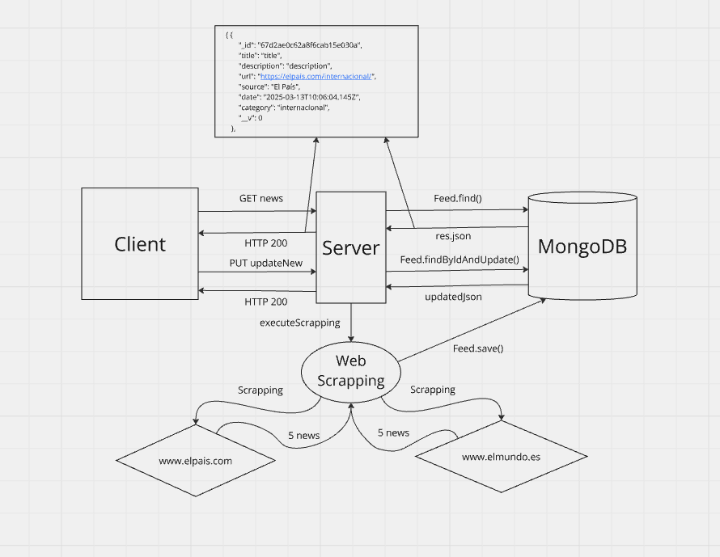

# daily-trends
# Agregador de noticias de diferentes periódicos

Esta es una API RESTful para gestionar noticias, desarrollada con **Node.js**, **TypeScript** y **MongoDB**.  

## 🚀 Características
- CRUD de noticias.
- Filtrado por categoría y fecha.
- Persistencia en MongoDB.
- Desarrollo en TypeScript

## 📌 Tecnologías utilizadas
- Node.js
- TypeScript
- Express.js
- MongoDB (Mongoose)
- Docker 

## Arquitectura de la API




## 📦 Instalación
### 1️⃣ Clonar el repositorio
```sh
git clone (https://github.com/luisadelantado-vlc/daily-trends.git)
cd daily-trends
npm install
```
### 2️⃣ Configuración
Creamos un fichero .env y rellenamos los siguientes parámetros:
```sh
PORT=3000
MONGO_URI=mongodb://localhost:27017/newsdb
```
Podemos configurar los distintos medios que queremos utilizar y el número de noticias que queremos recuperar en ```config/scrapper-config.json```:

```json
{
    "media": [
      {
        "title": "El País",
        "url": "https://www.elpais.com",
        "articleSelector": "h2",
        "categoryPosition": 3,
        "descriptionSelector": "p",
        "numArticles": 5
      },
      {
        "title": "El Mundo",
        "url": "https://www.elmundo.es",
        "articleSelector": "title",
        "categoryPosition": 3,
        "descriptionSelector": "p.ue-c-article__paragraph",
        "numArticles": 5
      }
    ],
    "categories": [
      "internacional",
      "economia",
      "salud-y-bienestar",
      "deportes",
      "tecnologia",
      "cultura",
      "ciencia",
      "salud",
      "politica"
    ]
  }
```
Cada medio tiene los titulares, las descripciones y categorías en ubicaciones diferentes. Conviene hacer una investigación del medio del cual se quiere hacer el scrapping para poder poner los selectores adecuados.

### 3️⃣ Iniciamos la API
```sh
docker-compose down -v
docker-compose up --build -d
docker logs -f daily-trends-app-1
```

🔗 Rutas disponibles
| Método | Endpoint                      | Descripción                   |
|--------|-------------------------------|-------------------------------|
| GET    | `/feed`                        | Obtener todas las noticias    |
| POST   | `/feed/createNew`              | Crear una nueva noticia       |
| GET    | `/feed/category/:category`     | Obtener noticias por categoría |
| PUT    | `/feed/updateNew/:id`          | Actualizar una noticia        |
| DELETE | `/feed/deleteNew/:id`          | Eliminar una noticia          |
| GET    | `/feed/date/:date`             | Obtener noticias por fecha    |


